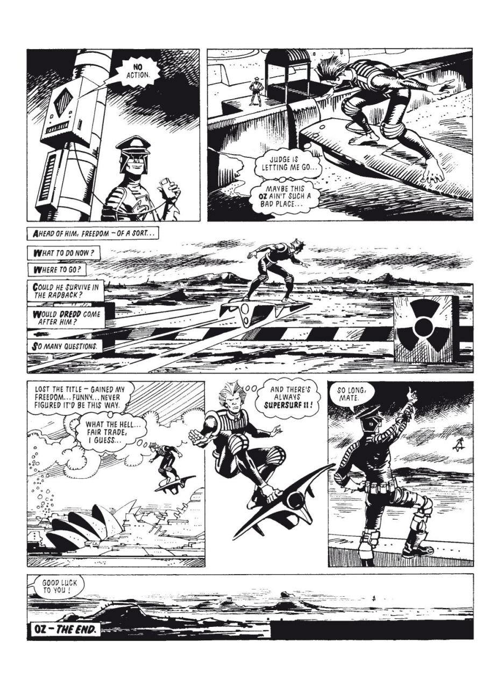

- vlm extraction example

```json
{
 "overall_summary": "The comic page depicts a character's escape from a dystopian setting, symbolized by a futuristic cityscape and a nuclear warning sign. The character experiences a mix of freedom and uncertainty as they leave behind their past and contemplate their future.",
 "panels": [
 {
 "panel_number": 1,
 "caption": "A character stands in front of a towering robot-like structure.",
 "description": "The character is dressed in a futuristic uniform, holding a device, and appears to be in a tense or contemplative state. The background features a large, imposing robot-like structure with a glowing eye, suggesting a high-tech or authoritarian environment.",
 "speakers": [
 {
 "character": "The character in the uniform",
 "dialogue": "NO ACTION.",
 "speech_type": "dialogue"
 }
 ],
 "key_elements": [
 "Towering robot-like structure",
 "Glowing eye",
 "Futuristic uniform",
 "Device in hand"
 ],
 "actions": [
 "Standing still",
 "Holding a device"
 ]
 },
 {
 "panel_number": 2,
 "caption": "The character is seen running across a futuristic landscape.",
 "description": "The character is sprinting across a wide, open area with a sleek, futuristic vehicle in the background. The setting includes a distant figure standing on a platform, observing the character's escape. The character appears determined and focused.",
 "speakers": [
 {
 "character": "The character in motion",
 "dialogue": "JUDGE IS LETTING ME GO... MAYBE THIS OZ AIN'T SUCH A BAD PLACE...",
 "speech_type": "thought"
 }
 ],
 "key_elements": [
 "Futuristic vehicle",
 "Distant observer",
 "Open landscape",
 "Character in motion"
 ],
 "actions": [
 "Running",
 "Looking back"
 ]
 },
 {
 "panel_number": 3,
 "caption": "The character continues running, with a nuclear warning sign in the background.",
 "description": "The character is still running, now with a nuclear warning sign prominently displayed in the background. The landscape is expansive, with distant mountains and a clear sky, emphasizing the character's journey away from the city. The text overlay poses questions about the character's future and survival.",
 "speakers": [
 {
 "character": "Narrator",
 "dialogue": "AHEAD OF HIM, FREEDOM - OF A SORT... WHAT TO DO NOW? WHERE TO GO? COULD HE SURVIVE IN THE RADBACK? WOULD DREDD COME AFTER HIM? SO MANY QUESTIONS.",
 "speech_type": "narration"
 }
 ],
 "key_elements": [
 "Nuclear warning sign",
 "Expansive landscape",
 "Distant mountains",
 "Clear sky"
 ],
 "actions": [
 "Running",
 "Looking ahead"
 ]
 },
 {
 "panel_number": 4,
 "caption": "The character is surfing on a futuristic vehicle.",
 "description": "The character is now riding a futuristic vehicle, which appears to be a hoverboard or similar device. The vehicle is sleek and advanced, and the character seems to be enjoying the experience. The background shows a cityscape with tall buildings and a distant figure watching the character's escape.",
 "speakers": [
 {
 "character": "The character surfing",
 "dialogue": "LOST THE TITLE - GAINED MY FREEDOM... FUNNY... NEVER FIGURED IT'D BE THIS WAY. WHAT THE HELL FAIR TRADE, I GUESS...",
 "speech_type": "thought"
 }
 ],
 "key_elements": [
 "Futuristic hoverboard",
 "Cityscape in the background",
 "Distant observer"
 ],
 "actions": [
 "Surfing",
 "Looking around"
 ]
 },
 {
 "panel_number": 5,
 "caption": "The character expresses excitement while surfing.",
 "description": "The character is still surfing on the futuristic vehicle, now with a more joyful and excited expression. The background shows a clear sky and distant figures, indicating the character's freedom and escape from the city. The character exclaims in excitement.",
 "speakers": [
 {
 "character": "The character surfing",
 "dialogue": "AND THERE'S ALWAYS SUPERSURF!!",
 "speech_type": "dialogue"
 }
 ],
 "key_elements": [
 "Futuristic hoverboard",
 "Clear sky",
 "Distant figures"
 ],
 "actions": [
 "Surfing",
 "Expressing excitement"
 ]
 },
 {
 "panel_number": 6,
 "caption": "Another character watches the escape and wishes the character well.",
 "description": "A different character, dressed in a uniform similar to the first character, is standing on a platform and watching the escaping character. This character appears to be wishing the escaping character well, with a gesture of farewell.",
 "speakers": [
 {
 "character": "The character on the platform",
 "dialogue": "SO LONG, MATE.",
 "speech_type": "dialogue"
 }
 ],
 "key_elements": [
 "Platform",
 "Uniformed character",
 "Futuristic landscape"
 ],
 "actions": [
 "Waving goodbye",
 "Watching the escape"
 ]
 },
 {
 "panel_number": 7,
 "caption": "The escaping character is seen from a distance, with a farewell message.",
 "description": "The escaping character is now far away, seen from a distance as they continue their journey. The background shows a vast, open landscape, emphasizing the character's newfound freedom. Another character, possibly the same one from the previous panel, is seen in the distance, wishing the escaping character well.",
 "speakers": [
 {
 "character": "The character in the distance",
 "dialogue": "GOOD LUCK TO YOU!",
 "speech_type": "dialogue"
 }
 ],
 "key_elements": [
 "Vast landscape",
 "Escaping character in the distance",
 "Farewell gesture"
 ],
 "actions": [
 "Continuing to surf",
 "Moving away"
 ]
 }
 ],
 "summary": {
 "characters": [
 "Escaping character (surfing)",
 "Uniformed character (observer)",
 "Another uniformed character (farewell)"
 ],
 "setting": "A futuristic, dystopian cityscape with advanced technology, nuclear warnings, and expansive landscapes. The setting transitions from a confined, authoritarian environment to an open, free landscape.",
 "plot": "The comic depicts a character escaping from a dystopian city, symbolized by a towering robot and nuclear warnings. The character experiences a mix of freedom and uncertainty, contemplating their future and survival. The escape is marked by joy and excitement, as the character surfs on a futuristic vehicle, while others bid them farewell.",
 "dialogue": [
 "NO ACTION.",
 "JUDGE IS LETTING ME GO... MAYBE THIS OZ AIN'T SUCH A BAD PLACE...",
 "AHEAD OF HIM, FREEDOM - OF A SORT... WHAT TO DO NOW? WHERE TO GO? COULD HE SURVIVE IN THE RADBACK? WOULD DREDD COME AFTER HIM? SO MANY QUESTIONS.",
 "LOST THE TITLE - GAINED MY FREEDOM... FUNNY... NEVER FIGURED IT'D BE THIS WAY. WHAT THE HELL FAIR TRADE, I GUESS...",
 "AND THERE'S ALWAYS SUPERSURF!!",
 "SO LONG, MATE.",
 "GOOD LUCK TO YOU!"
 ]
 }
}
```

