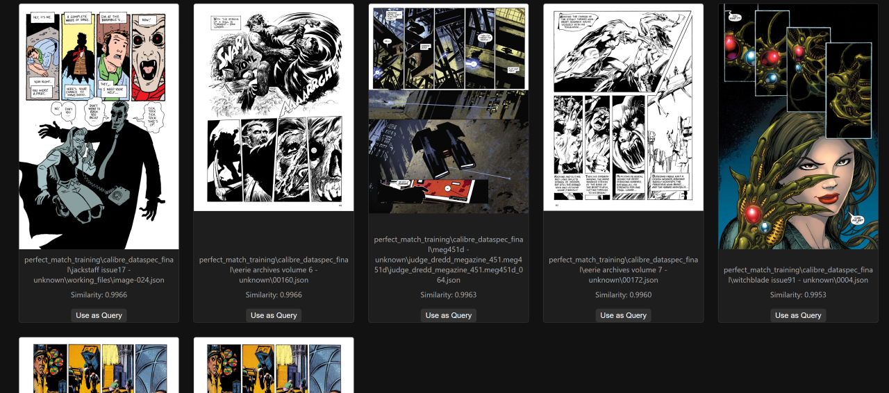
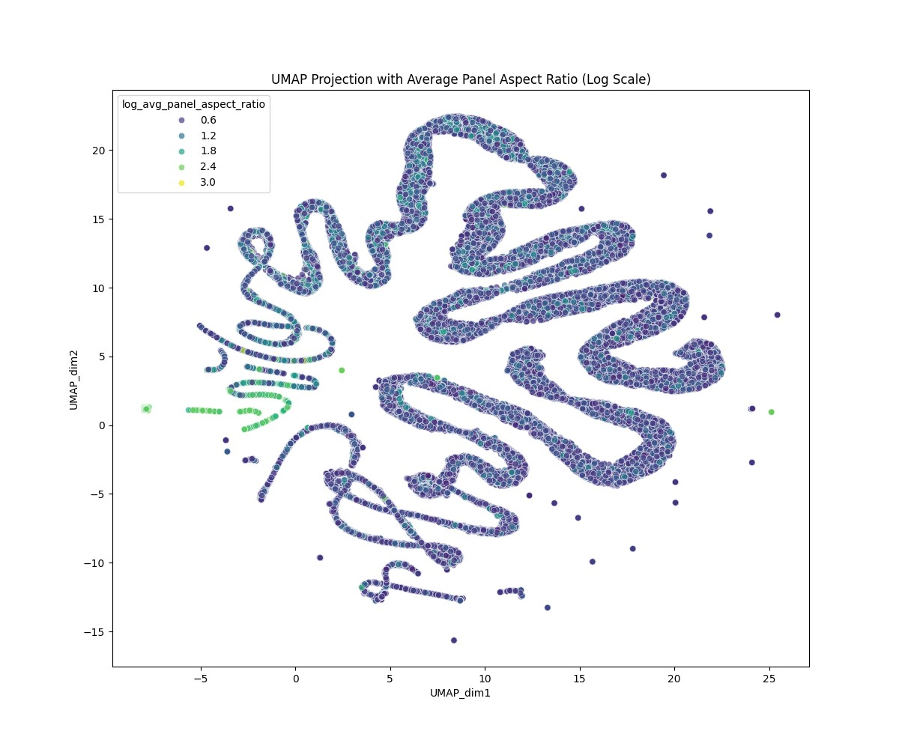

# CoMix: Comic Analysis Project Overview

This document outlines the ongoing work in analyzing comics using data science techniques, focusing on multimodal modeling for content understanding and querying.

## 1. Project Goals & Evolution

*   **Version 1 (Closure Lite Framework):**
    *   **Aim:** To combine page image and VLM text for querying, with panel and reading order recognition.
    *   **Key Choice:** Utilized 384-dimensional "lite" embeddings to allow for testing on retail GPUs.
    *   **Model:** Based on the [RichardScottOZ/comics-analysis-closure-lite-simple](https://huggingface.co/RichardScottOZ/comics-analysis-closure-lite-simple) model, trained as a context-denoise variant.
*   **Version 2 (Current Focus):** Initiating work towards a new, more robust modeling framework, particularly for Page Stream Segmentation.

## 2. Core Framework: Closure Lite

The Closure Lite Framework is a multimodal fusion model designed to analyze images, text, and panel reading order.

*   **Objective:** Generate multimodal fused embeddings that are queryable for similarity.
    *   Embeddings are efficiently stored in Zarr format (e.g., 80K "perfect match subset" takes ~500MB).
    *   An interface (Flask-based) exists for querying.
*   **Design Principle:** Usable on a reasonable retail GPU (hence 384-dim embeddings).
*   **Model Variants:** `base`, `denoise`, `context`, `context-denoise`.

## 3. Data Sources & Preparation

*   **Primary Data:** Comic pages from various sources (Amazon/Comixology, Dark Horse, Calibre-managed collections like Humble Bundle and DriveThruComics).
*   **Future Data:** Exploring new Humble Bundles and potential scraping (e.g., Neon Ichigan).
*   **Initial Processing:**
    *   **Conversion:** Comic files (PDF, CBZ, etc.) are converted into individual page images.
    *   **VLM Text Extraction:** Vision-Language Models (VLMs) are used to extract text from each page, preceding general OCR due to its comic-specific challenges.
    *   **Panel Detection:** Fast-RCNN is used to detect panel bounding boxes and coordinates.
    *   **DataSpec Integration:** All extracted data is joined into a `DataSpec` format for modeling.
*   **Dataset Size:** Currently working with a "Calibre" subset of ~330K pages (compared to ~805K Amazon pages).

## 4. Basic Workflow

1.  **Find Comics:** Gather digital comic files.
2.  **Convert to Pages:** Extract images from containers (PDF, CBZ, etc.).
3.  **VLM Analysis:** Use VLMs to get panel text for each page.
4.  **R-CNN Panel Detection:** Get panel bounding boxes and coordinates.
5.  **Data Integration:** Join data into `DataSpec` (e.g., using `coco_to_dataspec`).
6.  **Perfect Match Subset:** Create high-quality subsets for training.
7.  **Model Training:** Train the Closure Lite model (using `closure_lite_dataset`, `closure_lite_simple_framework`, `train_closure_lite_simple_with_list`).
8.  **Embedding Generation:** Run the trained model to generate queryable embeddings.
9.  **Querying:** Access embeddings via code or a dedicated interface.

## 5. Perfect Match Dataset Notes

*   **Goal:** Ensure text alignment with the correct panels (same number of panels from R-CNN and VLM).
*   **Challenge:** Initial alignment between Fast-RCNN and various VLM runs was only ~25%, indicating a need to improve this step or consider alternative approaches (e.g., OCR for Fast-RCNN).

## 6. Key Results from Closure Lite (80K Calibre Subset, Context-Denoise)

### Panel Similarity
*   An early model showed panel similarities, with the model cutting things off at 12 panels.

### Page Similarity
*   The model demonstrated understanding of page composition and structure.

### Clustering (UMAP Embeddings)
*   UMAP embeddings revealed distinct clusters.

*   **Landscape Cluster:** A "ribbon cluster" was identified as a "landscape cluster" (pages with landscape orientation), which is less common in comics.

*   **Data Noise:** An adjoining part of this cluster was found to be an error, containing extracted pages from non-comic content (e.g., computing books), highlighting the need for better data filtering.

### Ablation Study (Vision-Only Embeddings)
*   Clustering of vision-only embeddings showed distinct patterns.

*   **Cluster 8:** Identified as "all single panel very dark images" and "heavy text one page images," with a few multi-panel pages. A disconnected group of "all white images" formed a monochromatic sub-cluster.
*   **Aspect Ratios:** Vision-only clustering also picked out significant differences in panel aspect ratios.

## 7. Relevant Research & Future Tasks

### Relevant Research
*   **Survey:** "One missing piece in Vision and Language: A Survey on Comics Understanding" (https://arxiv.org/abs/2409.09502v1)
*   **Neural Networks & Transformers:** "Investigating Neural Networks and Transformer Models for Enhanced Comic Decoding" (https://dl.acm.org/doi/10.1007/978-3-031-70645-5_10)
*   **Image Indexing:** "Digital Comics Image Indexing Based on Deep Learning" (https://www.researchgate.net/publication/326137469_Digital_Comics_Image_Indexing_Based_on_Deep_Learning)
*   **Synthesis of Graphic Novels:** "A Deep Learning Pipeline for the Synthesis of Graphic Novels" (https://computationalcreativity.net/iccc21/wp-content/uploads/2021/09/ICCC_2021_paper_52.pdf)
*   **Papers:**
    *   https://arxiv.org/abs/2503.08561
    *   https://www.researchgate.net/publication/389748978_ComicsPAP_understanding_comic_strips_by_picking_the_correct_panel?
    _tp=eyJjb250ZXh0Ijp7ImZpcnN0UGFnZSI6InB1YmxpY2F0aW9uIiwicGFnZSI6InB1YmxpY2F0aW9uIn19
        - https://huggingface.co/VLR- ComicsPap models

    *   https://www.researchgate.net/publication/326137469_Digital_Comics_Image_Indexing_Based_on_Deep_Learning
    *   https://computationalcreativity.net/iccc21/wp-content/uploads/2021/09/ICCC_2021_paper_52.pdf

### Tasks of Interest
*   Dialogue transcription, which necessitates a robust panel detection pipeline.

## 8. Pipeline Details

*   Refer to the main CoMix repository.
*   The code in `detections_2000ad` contains adaptations for inference, distinct from evaluation.
*   Detailed functions are in `https://github.com/emanuelevivoli/CoMix/tree/main/benchmarks/detections`.
*   **Technical Stack:** PyTorch (CUDA 11.8 recommended).

## 9. VLM Model Experiments & Possibilities

Extensive testing has been conducted with various Vision-Language Models for text extraction and analysis:

*   **Gemini 4B:** Handles basics, but fails on some perpetually (reason yet to be understood; Fourier analysis suggested).
*   **Gemma 12B:** Can handle some failures of Gemini 4B.
*   **Mistral 3.1:** Generally identifies "character A and character B," can handle Gemini failures.
*   **Qwen 2.5 VL Instruct:** Failed on the same cases as Gemini 4B.
*   **Phi4:** Not very good.
*   **Llama 11B:** Failed to process.
*   **Gemini Flash 1.5:** Capable of handling missing/null captions and characters.
*   **Gemini Flash 2.5 Lite:** Good performance, but 8x more expensive than Gemma 4B (which can run locally). Experienced quite a few connection errors with Google. On the hardest 660 samples, had 1/3 errors and 1/5 JSON errors.
*   **GPT Nano 4.1:** Reported "unsupported image type," indicating lower capability than Google's models.
*   **Meta Llama 4 Scout:** Much better, with 300/500 success on remaining images, and better cost efficiency (0.08/0.3 vs 0.10/0.40 for Gemini Flash Lite 2.5). However, encountered significant problems with the GMI Cloud provider.

## 10. Embeddings Generation Strategy

*   **To Generate:** Panel embeddings (P), Page embeddings (E_page), Reading order embeddings.
*   **Dataset Coverage:** Amazon perfect matches (212K pages), CalibreComics perfect matches (80K), and a combined dataset of all high-quality samples.
*   **Technical Approach:** Batch Processing Script.

## 11. Page Stream Segmentation (PSS) & CoSMo

*   **Importance:** PSS is crucial for the next version of the project, feeding page type markers into multimodal fusion.
*   **CoSMo Model:**
    *   [GitHub Repository](https://github.com/mserra0/CoSMo-ComicsPSS) (includes arXiv paper link).
    *   Specifically designed for PSS.
    *   Uses Qwen 2.5 VL 32B for OCR.
    *   **Consideration:** Is Gemma as good/cost-effective for OCR?
    *   **Current Status:** No pre-trained model available for direct testing; requires training a new one.

## 12. Future Research

*   Refer to `documentation/future_work/`.
