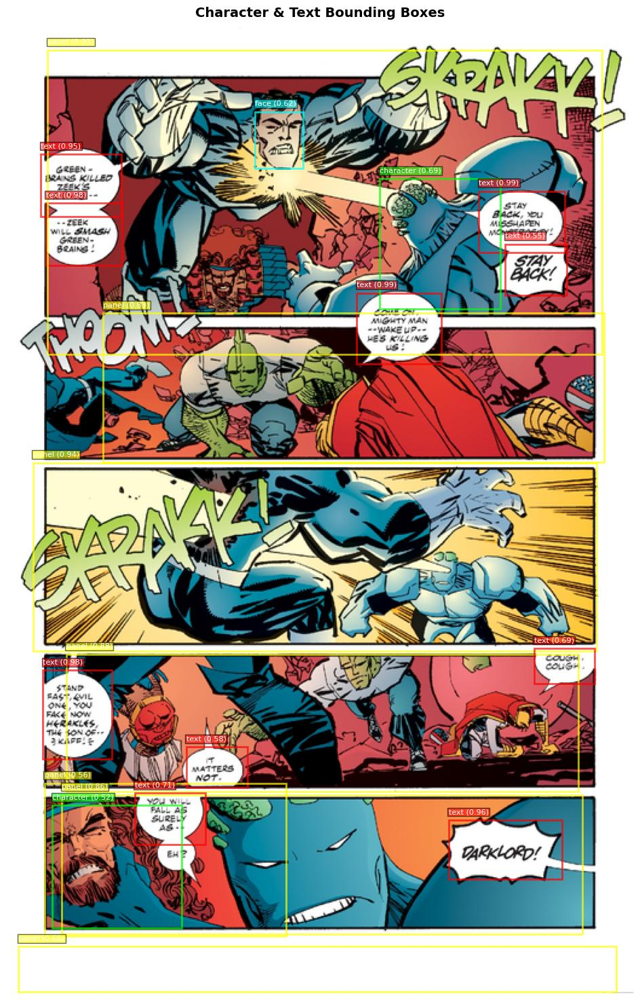

# Comic-Analysis
Work on looking at analysis of comics with data science
## Repo
Scattered work in progress being reorganised as version 1 wraps up.
### src
- comix
    - The CoMix repo original code and some additions I used for testing of capability and datasets
    - the 2000ad directory there is my versions with testing on some comics from the aforementioned due to handy quick downloads
- calibre
    - Updated work looking at modelling based on a 'Calibre' subset of comics - things from multiple not Amazon sources and the name references the great Digital library storage tool Calibre - also a smaller subset so good for testing
    - Amazon = Comixology but shorter to type and less likely to make me annoyed evoking the old name and how good it was.

# Closure Lite Framework
- A multimodal fusion model to look at images, text and panel reading order.
    - Aim - get multimodal fused embeddings that would be queryable for similarity
        - Embeddings stored in zarr works nicely for speed at size currently
            - 80K 'perfect match subset' test takes up around 500MB on disk.
        - See interface - with a flask ask to do that
    - Designed to be useable on a reasonable retail GPU - so 384 dim ebeddings etc.
    - Options
        base, denoise, context, context-denoise

## Data
- Comic pages, lots of them.
- VLM text extraction test - basically I wanted to try this ahead of general OCR - which is definitely not aimed at comics.

## Basic Process
# Basic Process

Find comics
- amazon
- dark horse
- calibre [humble bundle, drive thru etc.] 
- TODO; neon ichigan scraping? new humble bundle 
    - deal with duplicate comics - no point having two copies in embeddings

Convert to pages - from pdf/cbz etc.

Use VLMS to get panel text for each page

Use Fast-RCNN to get panel boxes and coords

Join together into DataSpec for modelling
- coco_to_dataspec

Make perfect match subset for training properly

Train model
- users closure_lite_dataset - closure_lite_simple_framework - train_closure_lite_simple_with_list

Embeddings
- Run model to make embeddings

Query
- By Code or Interface

## Perfect Match Notes

- Make sure text is as close to right panels as we can - same number from rcnn and vlm
    - Train with this dataset
- We got 25% alignment betwen fast-rcnn and various vlm runs - so need to work out what is best and affordable there
    - do we need to ocr fast rcnn

# Results
- From 80K calibre perfect match subset using the context-denoise option

- vlm extraction example

```json
{
 "overall_summary": "The comic page depicts a character's escape from a dystopian setting, symbolized by a futuristic cityscape and a nuclear warning sign. The character experiences a mix of freedom and uncertainty as they leave behind their past and contemplate their future.",
 "panels": [
 {
 "panel_number": 1,
 "caption": "A character stands in front of a towering robot-like structure.",
 "description": "The character is dressed in a futuristic uniform, holding a device, and appears to be in a tense or contemplative state. The background features a large, imposing robot-like structure with a glowing eye, suggesting a high-tech or authoritarian environment.",
 "speakers": [
 {
 "character": "The character in the uniform",
 "dialogue": "NO ACTION.",
 "speech_type": "dialogue"
 }
 ],
 "key_elements": [
 "Towering robot-like structure",
 "Glowing eye",
 "Futuristic uniform",
 "Device in hand"
 ],
 "actions": [
 "Standing still",
 "Holding a device"
 ]
 },
 {
 "panel_number": 2,
 "caption": "The character is seen running across a futuristic landscape.",
 "description": "The character is sprinting across a wide, open area with a sleek, futuristic vehicle in the background. The setting includes a distant figure standing on a platform, observing the character's escape. The character appears determined and focused.",
 "speakers": [
 {
 "character": "The character in motion",
 "dialogue": "JUDGE IS LETTING ME GO... MAYBE THIS OZ AIN'T SUCH A BAD PLACE...",
 "speech_type": "thought"
 }
 ],
 "key_elements": [
 "Futuristic vehicle",
 "Distant observer",
 "Open landscape",
 "Character in motion"
 ],
 "actions": [
 "Running",
 "Looking back"
 ]
 },
 {
 "panel_number": 3,
 "caption": "The character continues running, with a nuclear warning sign in the background.",
 "description": "The character is still running, now with a nuclear warning sign prominently displayed in the background. The landscape is expansive, with distant mountains and a clear sky, emphasizing the character's journey away from the city. The text overlay poses questions about the character's future and survival.",
 "speakers": [
 {
 "character": "Narrator",
 "dialogue": "AHEAD OF HIM, FREEDOM - OF A SORT... WHAT TO DO NOW? WHERE TO GO? COULD HE SURVIVE IN THE RADBACK? WOULD DREDD COME AFTER HIM? SO MANY QUESTIONS.",
 "speech_type": "narration"
 }
 ],
 "key_elements": [
 "Nuclear warning sign",
 "Expansive landscape",
 "Distant mountains",
 "Clear sky"
 ],
 "actions": [
 "Running",
 "Looking ahead"
 ]
 },
 {
 "panel_number": 4,
 "caption": "The character is surfing on a futuristic vehicle.",
 "description": "The character is now riding a futuristic vehicle, which appears to be a hoverboard or similar device. The vehicle is sleek and advanced, and the character seems to be enjoying the experience. The background shows a cityscape with tall buildings and a distant figure watching the character's escape.",
 "speakers": [
 {
 "character": "The character surfing",
 "dialogue": "LOST THE TITLE - GAINED MY FREEDOM... FUNNY... NEVER FIGURED IT'D BE THIS WAY. WHAT THE HELL FAIR TRADE, I GUESS...",
 "speech_type": "thought"
 }
 ],
 "key_elements": [
 "Futuristic hoverboard",
 "Cityscape in the background",
 "Distant observer"
 ],
 "actions": [
 "Surfing",
 "Looking around"
 ]
 },
 {
 "panel_number": 5,
 "caption": "The character expresses excitement while surfing.",
 "description": "The character is still surfing on the futuristic vehicle, now with a more joyful and excited expression. The background shows a clear sky and distant figures, indicating the character's freedom and escape from the city. The character exclaims in excitement.",
 "speakers": [
 {
 "character": "The character surfing",
 "dialogue": "AND THERE'S ALWAYS SUPERSURF!!",
 "speech_type": "dialogue"
 }
 ],
 "key_elements": [
 "Futuristic hoverboard",
 "Clear sky",
 "Distant figures"
 ],
 "actions": [
 "Surfing",
 "Expressing excitement"
 ]
 },
 {
 "panel_number": 6,
 "caption": "Another character watches the escape and wishes the character well.",
 "description": "A different character, dressed in a uniform similar to the first character, is standing on a platform and watching the escaping character. This character appears to be wishing the escaping character well, with a gesture of farewell.",
 "speakers": [
 {
 "character": "The character on the platform",
 "dialogue": "SO LONG, MATE.",
 "speech_type": "dialogue"
 }
 ],
 "key_elements": [
 "Platform",
 "Uniformed character",
 "Futuristic landscape"
 ],
 "actions": [
 "Waving goodbye",
 "Watching the escape"
 ]
 },
 {
 "panel_number": 7,
 "caption": "The escaping character is seen from a distance, with a farewell message.",
 "description": "The escaping character is now far away, seen from a distance as they continue their journey. The background shows a vast, open landscape, emphasizing the character's newfound freedom. Another character, possibly the same one from the previous panel, is seen in the distance, wishing the escaping character well.",
 "speakers": [
 {
 "character": "The character in the distance",
 "dialogue": "GOOD LUCK TO YOU!",
 "speech_type": "dialogue"
 }
 ],
 "key_elements": [
 "Vast landscape",
 "Escaping character in the distance",
 "Farewell gesture"
 ],
 "actions": [
 "Continuing to surf",
 "Moving away"
 ]
 }
 ],
 "summary": {
 "characters": [
 "Escaping character (surfing)",
 "Uniformed character (observer)",
 "Another uniformed character (farewell)"
 ],
 "setting": "A futuristic, dystopian cityscape with advanced technology, nuclear warnings, and expansive landscapes. The setting transitions from a confined, authoritarian environment to an open, free landscape.",
 "plot": "The comic depicts a character escaping from a dystopian city, symbolized by a towering robot and nuclear warnings. The character experiences a mix of freedom and uncertainty, contemplating their future and survival. The escape is marked by joy and excitement, as the character surfs on a futuristic vehicle, while others bid them farewell.",
 "dialogue": [
 "NO ACTION.",
 "JUDGE IS LETTING ME GO... MAYBE THIS OZ AIN'T SUCH A BAD PLACE...",
 "AHEAD OF HIM, FREEDOM - OF A SORT... WHAT TO DO NOW? WHERE TO GO? COULD HE SURVIVE IN THE RADBACK? WOULD DREDD COME AFTER HIM? SO MANY QUESTIONS.",
 "LOST THE TITLE - GAINED MY FREEDOM... FUNNY... NEVER FIGURED IT'D BE THIS WAY. WHAT THE HELL FAIR TRADE, I GUESS...",
 "AND THERE'S ALWAYS SUPERSURF!!",
 "SO LONG, MATE.",
 "GOOD LUCK TO YOU!"
 ]
 }
}
```

# Relevant Research
## Survey
- One missing piece in Vision and Language: A Survey on Comics Understanding https://arxiv.org/abs/2409.09502v1
- Investigating Neural Networks and Transformer Models for Enhanced Comic Decoding - https://dl.acm.org/doi/10.1007/978-3-031-70645-5_10

# Tasks of Interest
- Dialogue transcription
- Therefore, needs a pipeline above that can detect panels

# Pipeline
- See Comix repo
- the code in detections_2000ad are adaptations of the similarly named functions in CoMix/detections to just be inference and not worry about evaluations of models
- https://github.com/emanuelevivoli/CoMix/tree/main/benchmarks/detections
- refer there for details, but basically

- install pytorch as per pytorch site instructions
- using CUDA 11.8 so far

# Model Possibilities
## VLMS - current generation
- Some newer VLMs can basically zero shot this problem to some degree, including some cheap models

# NOTES
# Gemini 4B - can do basics
- fails on some perpeptually?
- yet to be understood why
- perhaps look at fourier analysis?

# Gemma 12B - can handle some failures of 4B

# Mistral 3.1
- character A and character B only generally but can handle gemini failures

# Qwen 2.5 VL Instruct failed on same that gemini 4B did

# Phi4 not very good

# Lllama 11B failed to process

# Mistral 3.1
- character A and character B only generally but can handle gemini failures

# Qwen 2.5 VL Instruct 
- failed on same that gemini 4B did

# Gemini Flash 1.5 
- can do missing - some null captions and characters

# Gemini Flash 2.5 flash lite
- can do missing 
- good, but output is 8 times more expensive than gemma 4B - which could run locally
- quite a few connection errors with google as the provider
- on the last hardest 660 had  1/3 errors and 1/5 json errors

# GPT Nano 4.1 says unsupported image type?
- so not as good as google which can handle

# Meta Llama 4 Scout
- much better, success on 300 out of 500 images left at the end 
- also 0.08/0.3 compared to 0.10/0.40 for Gemini Flash Lite 2.5 - so way better
- GMI Cloud provider big problems


# Future Research
- https://arxiv.org/abs/2503.08561
- https://www.researchgate.net/publication/389748978_ComicsPAP_understanding_comic_strips_by_picking_the_correct_panel?_tp=eyJjb250ZXh0Ijp7ImZpcnN0UGFnZSI6InB1YmxpY2F0aW9uIiwicGFnZSI6InB1YmxpY2F0aW9uIn19

- https://www.researchgate.net/publication/326137469_Digital_Comics_Image_Indexing_Based_on_Deep_Learning

- A Deep Learning Pipeline for the Synthesis of Graphic Novels - https://computationalcreativity.net/iccc21/wp-content/uploads/2021/09/ICCC_2021_paper_52.pdf


## Embeddings
### Embedding Generation Strategy:
1. What We Need to Generate:
Panel embeddings (P) - Raw panel representations
Page embeddings (E_page) - Aggregated page-level representations
Reading order embeddings - For sequence understanding
2. Dataset Coverage:
Amazon perfect matches: 212K pages
CalibreComics perfect matches: 80K
Combined dataset: All high-quality samples
3. Technical Approach:
Option A: Batch Processing Script

# Page Stream Segmentation
- Needed for next version of the above
- Feed page type markers into multimodal fusion

## CoSMo
- https://github.com/mserra0/CoSMo-ComicsPS
    - arXiv paper link there
- Model designed to do this
    - Uses Qwen 2.5 VL 32B for OCR 
    - Which reddit seems to like a lot
    - Is Gemma as good?  e.g. costs

- No actual model to test
- Need to train one