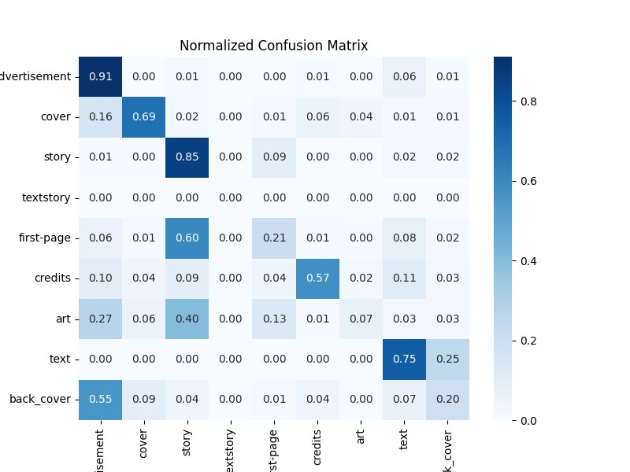
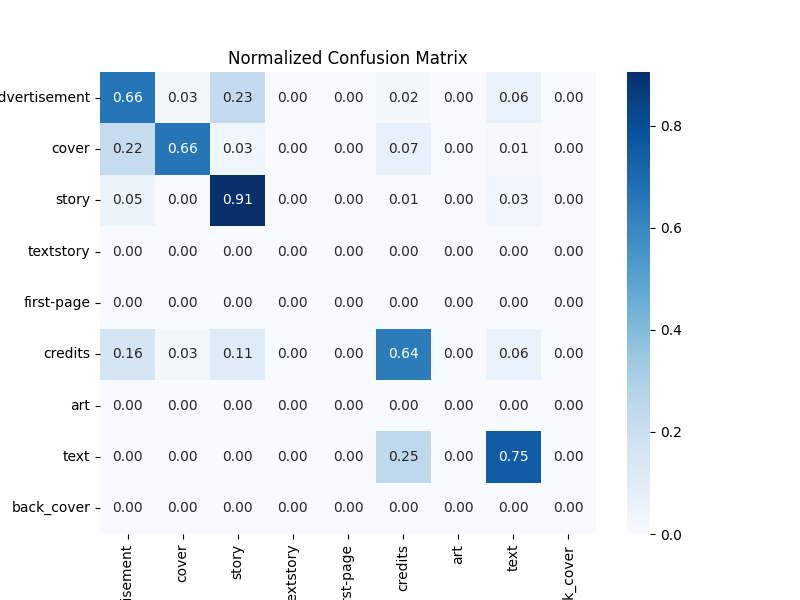

# First Cosmo run
- no textstory class
- first-page is an artificat of how the model and dataset is set up

Final Model Performance:

Average Book MNDD: 6.9605

Document-level Metrics:
  Precision: 0.5057
  Recall: 0.4685
  F1: 0.4652
  Segmentation Quality (SQ): 0.9535
  Panoptic Quality (PQ): 0.4426
               precision    recall  f1-score   support

advertisement       0.48      0.91      0.63       134
        cover       0.66      0.69      0.67        89
        story       0.89      0.85      0.87      1896
    textstory       0.00      0.00      0.00         0
   first-page       0.17      0.21      0.19       204
      credits       0.79      0.57      0.67       101
          art       0.48      0.07      0.13       162
         text       0.03      0.75      0.07         4
   back_cover       0.23      0.20      0.21        76

     accuracy                           0.72      2666
    macro avg       0.42      0.47      0.38      2666
 weighted avg       0.76      0.72      0.73      2666

# Second Cosmo Run

Combined advertisment, back cover and art

Final Model Performance:

Average Book MNDD: 4.5526

Document-level Metrics:
  Precision: 0.6033
  Recall: 0.5987
  F1: 0.5767
  Segmentation Quality (SQ): 0.9275
  Panoptic Quality (PQ): 0.5425
               precision    recall  f1-score   support

advertisement       0.63      0.66      0.65       372
        cover       0.72      0.66      0.69        89
        story       0.95      0.91      0.93      2100
    textstory       0.00      0.00      0.00         0
   first-page       0.00      0.00      0.00         0
      credits       0.70      0.64      0.67       101
          art       0.00      0.00      0.00         0
         text       0.03      0.75      0.06         4
   back_cover       0.00      0.00      0.00         0

     accuracy                           0.85      2666
    macro avg       0.34      0.40      0.33      2666
 weighted avg       0.89      0.85      0.87      2666